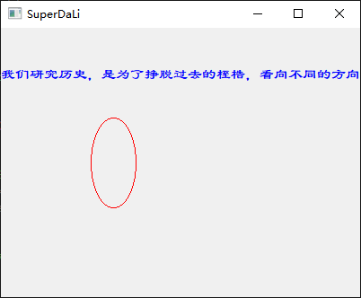
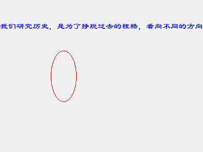
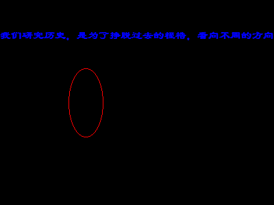
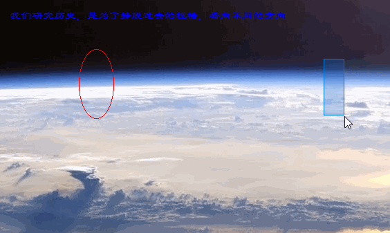
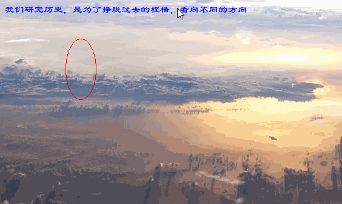

# Qt在透明控件上自由绘画

[TOC]

初学Qt，需要实现这样的效果：

> 在透明的`QWidget`上自由的绘图，看起来就像是直接在桌面绘图一样。

要达到这样的效果，需要分成两个步骤：

1. 如何将`QWidget`变得透明。
2. 如何在透明的`QWidget`控件上使用`QPainter`绘制图形。

当然，第二点是Widget透明之后才发现的需求，发现的过程后面会说。

两个需求完成总共花了大概3个小时。这期间刚开始一直中文搜索国内博客，没有解决任何一个问题。最后20来分钟没办法了，英文Google一下吧，结果没多久就找到了答案。

不知道为啥，国内各大博客论坛，关于Qt方面的内容又旧又乱，难道是没有什么新鲜血液进入了么？

为了让这3个小时价值最大化，于是有了这篇博客，也算是为Qt社群增砖添瓦吧。

此前，先把给我了帮助的两个网页挂出来鸣谢一下：

[关于透明Widget的]: https://stackoverflow.com/questions/25466030/make-qwidget-transparent/30596357#30596357


[Qt centre（关于透明绘制的）]: https://www.qtcentre.org/threads/36155-Freehand-drawing-on-transparent-widget

接下来是正题：

## 如何让QWidget变透明

先说一下被误导的尝试，关于让窗体透明，网友办法很多。

1.  `setWindowOpacity(0) ； `：设置完之后，窗体不会有任何显示，就像你从来没运行过程序一样。除了特殊用途，一般也不会有这种需求。
2. `setPalette(palette)`: 其中palette给一个透明的图片当背景，或者透明的颜色值。错误，设置完后，窗体会变成黑色。
3. ...不一一列举了...

进入整体，其实透明窗体实现相对简单，对你想要透明的QWidget对象设置三个属性就行了（构造函数还是main函数中设置，看你心情）。伪代码如下：

```C++
setWindowFlags(Qt::FramelessWindowHint);
setAttribute(Qt::WA_NoSystemBackground);
setAttribute(Qt::WA_TranslucentBackground);
setAttribute(Qt::WA_TransparentForMouseEvents);
```

稍微解释一下：

* **Qt::FramelessWindowHint**:

  > Produces a borderless window. The user cannot move or resize a borderless window via the window system.
  >
  > 产生一个无边框的窗体。**用户无法通过窗体系统移动窗体或者改变窗体的大小**。

  上面是Qt帮助文档中关于FramelessWindowHint标签的解释，该说的都说明了。需要关注的是，用户无法通过普通的方式改变窗体的大小和位置了。

* **Qt::WA_NoSystemBackground**：

  > Indicates that the widget has no background.
  >
  > 表明指定的widget没有背景。
  
  而默认的QWidget通常会自带一个白色的背景。计算机中，对于颜色，没有的意思一般都是黑色。例如，RGB值为0，0，0时。eum~有点懵，为啥要设置这个？？不纠结
  
* **Qt::WA_TranslucentBackground**:

  > Indicates that the widget should have a translucent background, i.e., any non-opaque regions of the widgets will be translucent because the widget will have an alpha channel. Setting this flag causes WA_NoSystemBackground to be set.
  >
  > 表明widget应该具有半透明的背景，即任何不透明的区域都将是半透明的。设置这个标签将导致`Qt::WA_NoSystemBackground`被同时设置。

  嗯~~不透明的区域半透明！！！什么鬼话。翻译一下，大概就是，应该透明的地方透明，不应该透明的地方不透明，例如：没有任何控件的地方就是应该透明的，有子`QWidget`或者`QPainter`画出的线条的地方就不是透明的。

  还有一点挺有意思的，这个标签被设置后，`Qt::WA_NoSystemBackground`也会被设置，所以其实伪代码中的`setAttribute(Qt::WA_NoSystemBackground);`是可以省略的。

* **Qt::WA_TransparentForMouseEvents**:

  > When enabled, this attribute disables the delivery of mouse events to the widget and its children.
  >
  > 启用该属性时，将禁止想widget和它的子widget传递鼠标事件。

  这个属性后面会用，顺便在这里解释先。

最后，来看一下每个属性的效果，我的工程主窗体就是一个普通的`QWidget`，方便起见，显示了一个`Label`，并重写了`paintEvent`函数，使用`QPainter`画了一个椭圆。源码会在文末附上。



上面是什么属性都没有设置的`QWidget`，蓝色文字部分是一个`Label`，红色的椭圆是用`QPainter`画在`QWidget`上的。我们要达到的透明效果是，只能看到蓝色文字和红色椭圆，其它都是桌面背景。下面通过属性的一步步设置，仔细观察一下界面的变化吧。



上面是`setWindowFlags(Qt::FramelessWindowHint);`代码执行后的界面。QWidget的标题框消失了，但是还有默认背景。



上面是`setAttribute(Qt::WA_NoSystemBackground);`执行后的界面，还真的变黑了。不纠结


当当当~，这不就是我要的效果么。这是执行了`setAttribute(Qt::WA_TranslucentBackground);`的效果。背景其实就是我的桌面背景。

接下来一个问题就是，当`QWidget`变成透明背景后，居然没法响应鼠标了，鼠标的事件没有发给我的widget。来看看效果:



> 途中的`Lable`的拖动效果，是因为我重写了`QWidget`的`mouseMoveEvent`和`mousePressEvent函数`。代码大概是这样的：
>
> ```c++
> void Widget::mousePressEvent(QMouseEvent *event) {
>        mousePosition = event->globalPos();
> }
> void Widget::mouseMoveEvent(QMouseEvent *event) {
>        const QPoint position = pos() + event->globalPos() - mousePosition;
>        move(position.x(), position.y());
>        mousePosition = event->globalPos();
> }
> ```

只有鼠标在`Label`上时，`widget`才能够响应鼠标的拖拽动作，在`QPainter`画出的红色椭圆上，鼠标的效果和在桌面的效果没啥区别。无法效应鼠标，肯定就不能作画，毕竟我们的手绘是需要靠鼠标或者触控笔输入的。那么，怎么让透明的窗体相应鼠标的各种事件呢？

## 透明QWidget上响应鼠标事件

在透明的窗体上，不能响应鼠标事件，应该是**透明**这个因素造成的。更深层次的原因，暂时还不了解。但实验结果如此。

说说最终的解决思路吧：

1.  申明一个QPixmap，变量名为cacheMap。它将作为整个窗体（QWidget）的底图。
2. 初始化cacheMap，用近乎透明的颜色填充。
3. 在paintEvent函数中，通过QPainter将cacheMap绘制到窗体上，充作背景。

最终，虽然整个QWidget将会有一个近乎透明的背景图，也就是cacheMap存在，但它几乎时透明到人眼无法识别。对于计算机来说，就不是这样了。于是我们完成了目标。

核心代码如下：

```c++
/* 头文件 */    
QPixmap *cacheMap;
/* cpp文件 构造函数中 */       
cacheMap = new QPixmap(this->size());
cacheMap->fill(QColor(0, 0, 0, 1));
/* cpp文件 paintEvent函数中 */     
void Widget::paintEvent(QPaintEvent *e) {
    QPainter painter(this);
    painter.drawPixmap(0, 0, *cacheMap);
}
```

最终效果如下：



对于绘图来讲，拿到了鼠标的事件，只需要记录鼠标轨迹，就可以通过QPainter来绘制出轨迹了。简单粗暴点的，可以直接将鼠标的轨迹点全部用直线链接起来，也可以用Bezier曲线拟合，另外可以通过控制cacheMap的绘制与否，来控制鼠标是否穿透到桌面来实现特殊的效果。当然，这些又是另的话题了。

源码下载链接：https://download.csdn.net/download/qq_25333681/11979920

在csdn下载可能需要点积分，如果你恰好没有，留言留下邮箱，我发给你。