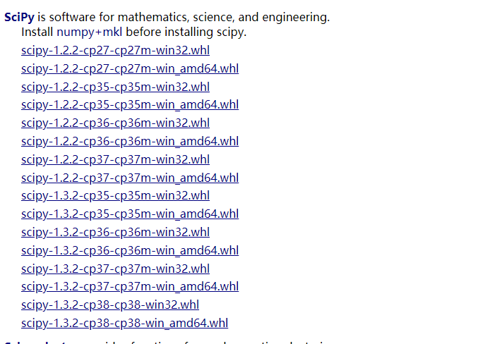
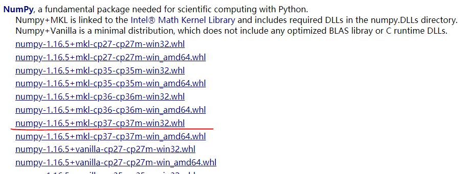

# windows Python/pip/numpy/matplot/scipy安装

[TOC]

最近在研究触控屏设备的**手写轨迹**拟合（仿真），需要用到贝塞尔曲线。某一天，突然在网上看到一篇博客，有理有据，清晰易懂，瞬间膜拜。所以决定研究一下。它的地址是：

[点这里]: https://www.cnblogs.com/zl03jsj/p/8047259.html

优秀的作者里边给出了算法，是python脚本写的。需要用到numpy、matplot、scipy等。安装这些库过程中，踩了不少坑，如果熟悉的话，完全可以避免，所以记录一下。希望小伙伴在安装之前可以首先找到这篇，避免去填这些坑吧。

对了，我是window10平台。

先说一下正确的姿势：

##  python3+安装

直接去官网下载目标版本：

[官网下载地址]: https://www.python.org/downloads/windows/

我这里下载的是3.7.4版本 **python-3.7.4.exe**

双击安装即可，建议安装尽量自定义安装，这样不仅可以自己选择安装目录（C盘太大了电脑会越用越卡），也可以安装IDE、pip、同时将python以及相关库添加进环境变量等等。

我安装时选择的是自定义安装，并且将所有安装选项都安装好了。这样安装好后pip之类的，就不用额外安装了。同时，各种环境变量也都配置好了。

接下来正常的操作就是安装numpy、scipy、matplot了。

安装了pip之后，可以直接使用

```python
pip install matplot
```

就可以安装成功了。需要说明的是scipy和numpy的安装。

## scipy安装

如果直接使用

```shell
pip install scipy
```

多半都是失败的。因为pip工具，默认下载的scipy版本只适合linux/unix 系统。所以我们只能手动去下载安装：

下载地址：

[python依赖下载链接]: https://www.lfd.uci.edu/~gohlke/pythonlibs/#numpy

该网页整合了非常多的库，scipy位置可能需要翻很久，此时，你只需要CTRL + F 组合键在浏览器搜一下**scipy**可以快速跳转到scipy的下载界面。



这里的命名规则有点不清楚，网页中应该也有写，但没去看，下了几个尝试了一下。规则大概是：

**库名称-版本号-对应的python版本号-python版本号+m-平台.whl**

如**scipy‑1.2.2‑cp27‑cp27m‑win32.whl**表示：运行在win32位平台，对应python2.7的1.2.2版本的scipy。

因为我的电脑是window平台，python版本是3.7，所以下载**scipy‑1.2.2‑cp37‑cp37m‑win32.whl**

并通过

```shell
pip install scipy‑1.2.2‑cp37‑cp37m‑win32.whl
```

安装成功了。此前安装scipy‑1.3.2‑cp37‑cp37m‑win32.whl和scipy‑1.2.2‑cp37‑cp37m‑win_amd64.whl都是不成功的。都报如下异常：

```shell
scipy-1.3.2-cp37-cp37m-win_amd64.whl is not a supported wheel on this platform.
```

所以建议大家尽量选择scipy的旧版本、平台选择32位安装。

## numpy安装

```shell
pip install numpy
```

命令安装numpy是可以直接成功。于是，我直接运行了脚本。结果~

```shell
Traceback (most recent call last):
  File "D:/workspace/py/Bezier_study/bezier.py", line 4, in <module>
    from scipy.special import comb, perm
  File "E:\devSoftware\python37\lib\site-packages\scipy\special\__init__.py", line 641, in <module>
    from ._ufuncs import *
ImportError: DLL load failed: 找不到指定的模块。
```

Duang~ 异常来得猝不及防。

找不到模块，Google了半天，原来numpy中有个叫mkl的模块，通过命令安装时，并不会包含该模块。所以又只能手动操作了。

* 下载包含了mkl模块的numpy：

  [numpy+mkl下载连接]: https://www.lfd.uci.edu/~gohlke/pythonlibs/#numpy

  

* 卸载之前通过命令安装的numpy：

  ```shell
  pip uninstall numpy
  ```

* 命令安装下载好的numpy+mkl：

  ```
  pip install numpy-1.16.5+mkl-cp37-cp37m-win32.whl
  ```

numpy就可以正常安装了。

## Python2.7 pip安装

python2.7安装后，没有python3+那么方便，无法在安装的同时将pip装上。只能手动下载pip。

* [下载地址]: https://pypi.org/project/pip/#files

解压后，进入到文件夹 shift + 鼠标左键，打开dos窗口。执行：

```python
python setup.py install
```

```python
PS C:\**\pip-19.3.1> python2.7 setup.py install
Traceback (most recent call last):
  File "setup.py", line 9, in <module>
    from setuptools import find_packages, setup
ImportError: No module named setuptools
```

报错，没有setuptools模块，去下载和安装该模块。

* [下载地址]: https://pypi.org/project/setuptools/#files

解压后，同样的方式进入解压文件夹，这时可以看到setup.py。

```python
python2.7 setup.py install	
```

这里我没遇到什么问题，如果看到：

```python
Installed /usr/lib/python2.7/site-packages/setuptools-41.6.0-py2.7.egg
Processing dependencies for setuptools==41.6.0
Finished processing dependencies for setuptools==41.6.0
```

说明也安装成功了。

我们回到pip安装：

```python
Installed /usr/lib/python2.7/site-packages/pip-19.3.1-py2.7.egg
Processing dependencies for pip==19.3.1
Finished processing dependencies for pip==19.3.1
```

Ok，看到Finished的输出，表示已经可用了。

pip 安装之后，在执行的python安装目录下，会生成一个Scripts的目录，pip.py便在这里。需要把Scripts配置到环境变量中，才可以在console中执行pip。

